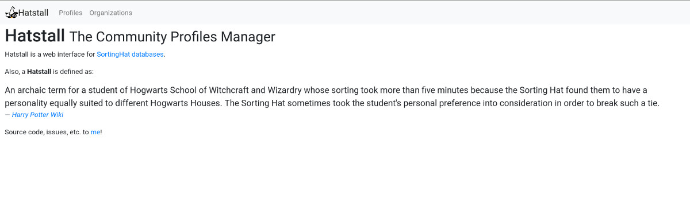
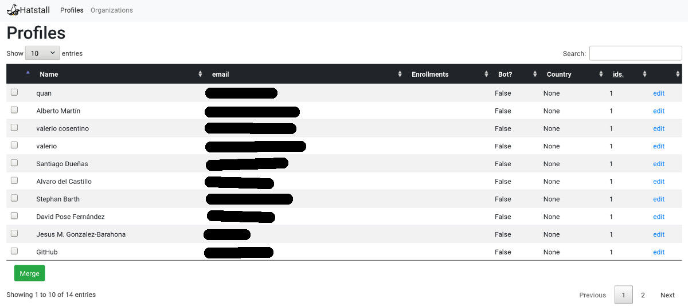
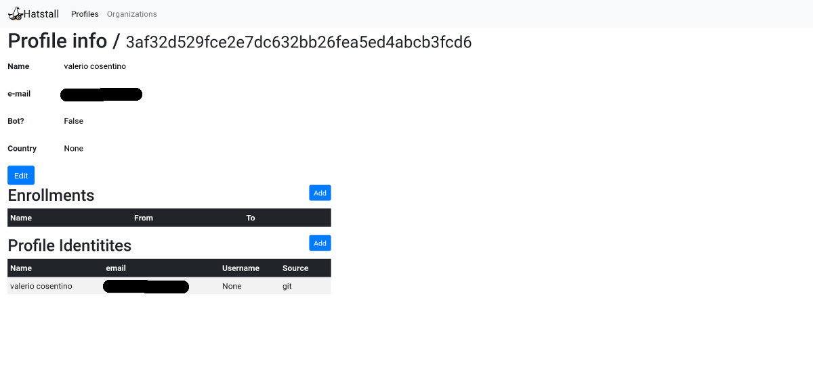
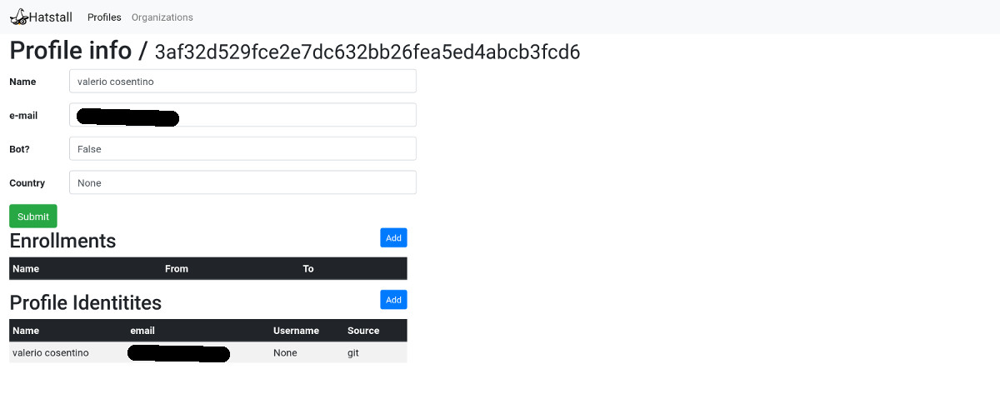
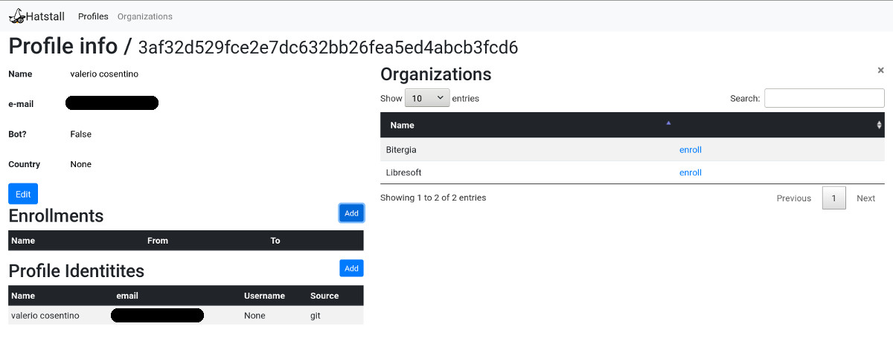
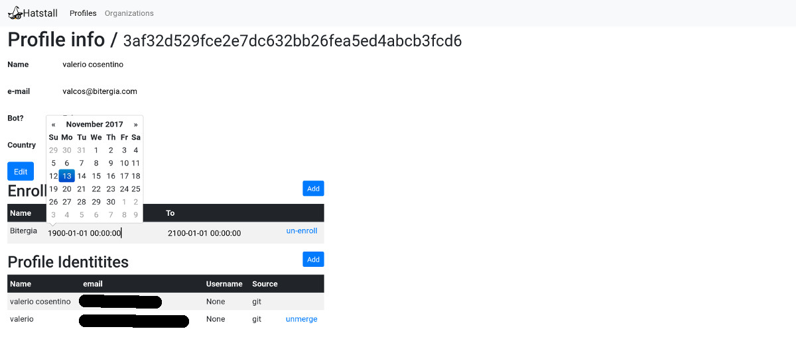
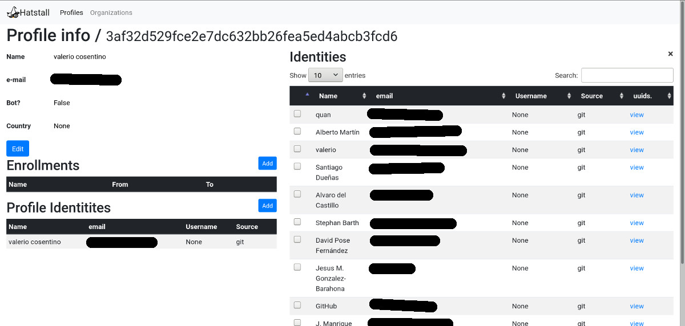
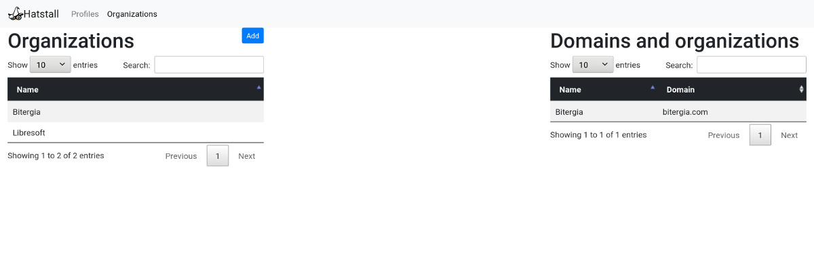
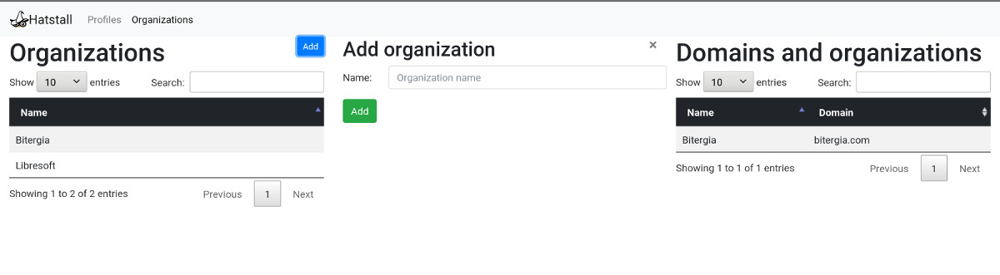

# Introduction

Managing community members profiles data can be very tedious:
* merging different profiles under a single one
* enroll a person to the right organization

There are already existing solutions, like `Jonathan Corbet's gitdm`, the current *SortingHat profiles update* solution based on providing a `.yml` file of the updates to be introduced, or even direct access to SortingHat database that are not perfect. For example:
* `gitdm` is focused in git related information, and *community* members go beyond coding
* current SortingHat solutions are not very *human friendly*, and the learning curve might be very high

So, @jsmanrique started working on a *PoC (Proof of Concept)* of a web UI to manage these processes by the community manager. This is how **Hatstall** started.

**Hatstall** is a web UI to manage part of [SortingHat](https://github.com/grimoirelab) data. 

The technologies involved are:
* For the backend:
  * We moved from [Flask](http://flask.pocoo.org/) to [Django](https://www.djangoproject.com/) as main framework
  * [SortingHat](https://github.com/grimoirelab/sortinghat/) to access to community profiles data (basically using [SortingHat API](https://github.com/grimoirelab/sortinghat/blob/master/sortinghat/api.py))
* For the front-end:
  * [Bootstrap](http://getbootstrap.com/) as main UI framework, and some extra plugins like [Bootstrap Datepicker](https://github.com/uxsolutions/bootstrap-datepicker/)
  * [DataTables JQuery plug-in](https://datatables.net/) to *search* and *order* data.

## Some disclaimers

* Hatstall doesn't run any data update in the rest of [Grimoirelab](http://grimoirelab.github.io) infrastructure. Its aim is only to manage data in configured SortingHat database.
* It works well with *small* databases (up to 5K indentities). From there, you might notice lags requesting data, because it doesn't implement any pagination on data requests. In some parts of the process, it requests all the identities in the database.
* This project is on its early days, so don't expect high quality code here, yet :wink:

## Understanding SortingHat database

SortingHat stores and manages data about *community members*.

Community members are identified by the *identities* they are using in the different data sources (*git*, *github*, *bugzilla*, *slack*, etc.).

By default, each *identity* defines a *unique identity profile*. SortingHat is able to merge different *profiles* under a single one.

SortingHat is also able to manage community member *enrollments* information.

# Managing community profiles

`Profiles` page lists community profiles:

Profiles list page shows every profile existing in the SortingHat database, showing for each community member information like:
* profile name
* profile email
* organizations where the member has been enrolled
* boolean to check if member is a bot or not
* profile country
* number of different identities used by the profile in the project

User is able to merge already existing profiles using `Merge` button.

Using the `name` link allows Hatstall's user to see and manage unique profile info:

The `Edit` button allows Hatstall's user to modify profile main information:

Using **Enrollments** `Add` button, the user is able to *enroll* the profile to existing organizations in the database:

It's also possible to *un-enroll* a profile from an organization.

User is able to edit enrollment initial and final date.

Using **Profile Identities** `Add` it's possible to add identities to the profile from the list of existing ones:

Just select the ones you want to add, and click on the `Merge` button

# Managing organizations

`Organizations` link shows a list of existing organizations:

It's possible to add new organizations to the database:

*Under development*: User *shall* be able to add and edit organizations' *domains*.
