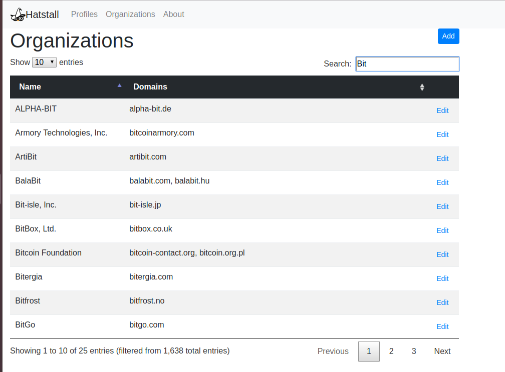
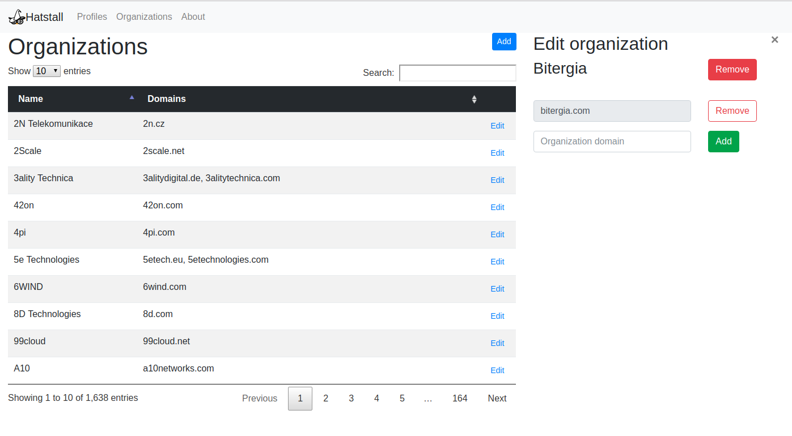

# Introduction

Managing community members profiles data can be very tedious with [SortingHat](https://github.com/chaoss/grimoirelab-sortinghat) for non technical users. HatStall is a Web application that provides an intuitive graphical interface to perform 
operations over a SortingHat database. The technologies used in HatStall are:
* For the backend:
  * [Django](https://www.djangoproject.com/)
  * [SortingHat API](https://github.com/chaoss/grimoirelab-sortinghat)
* For the front-end:
  * [Bootstrap](http://getbootstrap.com/) as main UI framework, and some extra plugins like [Bootstrap Datepicker](https://github.com/uxsolutions/bootstrap-datepicker/)
  * [DataTables JQuery plug-in](https://datatables.net/) to *search* and *order* data.

## Understanding SortingHat database

SortingHat stores and manages data about *community members*.

Community members are identified by the *identities* they are using in the different data sources (*git*, *github*, *bugzilla*, *slack*, etc.).

By default, each *identity* defines a *unique identity profile*. SortingHat is able to merge different *profiles* under a single one.

SortingHat is also able to manage community member *enrollments* information.

Details about SortingHat and its underlying approach in the following [reseach paper](https://www.researchgate.net/publication/331088184_SortingHat_Wizardry_on_Software_Project_Members):
``` 
Moreno, David, et al. SortingHat: wizardry on software project members. 
In 2019 IEEE/ACM 41st ICSE-Companion, pp. 51-54.
```

# Managing community profiles

`Profiles` page lists community profiles:


Profiles list page shows every profile existing in the SortingHat database, showing for each community member information like:
* profile name
* profile email
* organizations where the member has been enrolled
* boolean to check if member is a bot or not
* profile country
* number of different identities used by the profile in the project

User is able to merge already existing profiles using `Merge` button.

Using the `name` link allows Hatstall's user to see and manage unique profile info:


The `Edit` button allows Hatstall's user to modify profile main information:


Using **Enrollments** `Add` button, the user is able to *enroll* the profile to existing organizations in the database:


It's also possible to *un-enroll* a profile from an organization.

User is able to edit enrollment initial and final date.


Using **Profile Identities** `Add` it's possible to add identities to the profile from the list of existing ones:


Just select the ones you want to add, and click on the `Merge` button

# Managing organizations

`Organizations` link shows a list of existing organizations. On the top right corner, the `Add` button allows to add an organization, while `Search` box allows to search for a given organization.



For each organization listed, the button `Edit` (on the right side) allows to add/remove the organization domains or delete the organization completely.


